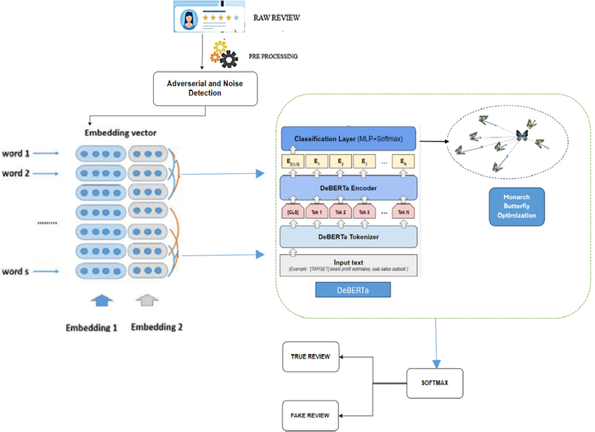
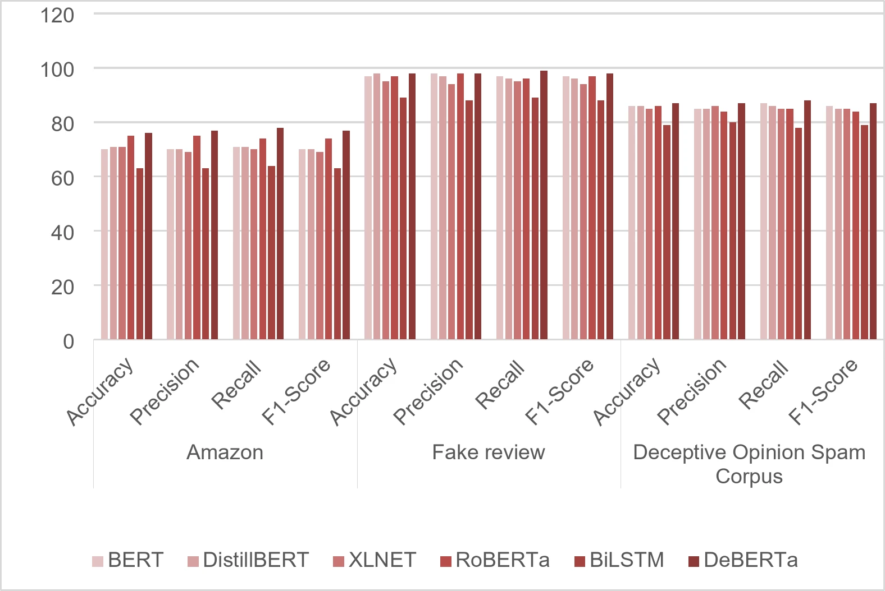
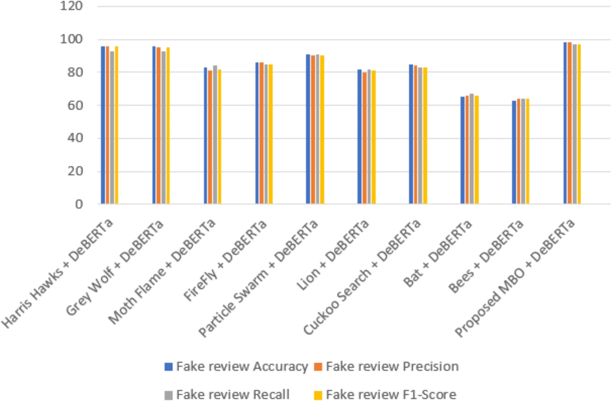
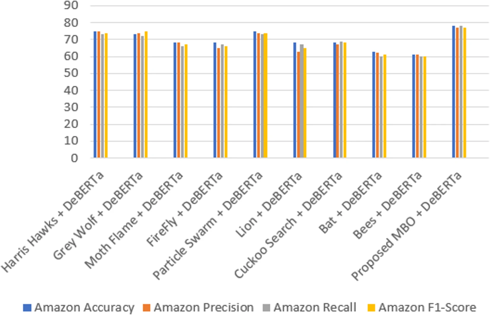
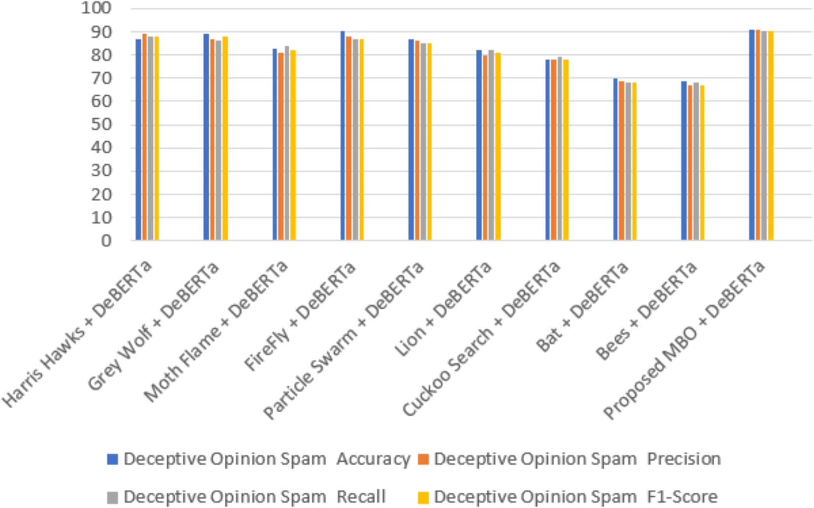

# MBO-DeBERTa: AI-Powered E-Commerce Fake Review Detection using pretrained DeBERTa Transformer Model Optimized with Monarch Butterfly Optimization (MBO) Algorithm 🔍

<div align="center">
  
  
  [](https://colab.research.google.com/drive/1PGBi88ihewWgRTGTRhc0DZjJ6xzLouBA?usp=sharing)
  [](https://opensource.org/licenses/MIT)
  [](https://www.nature.com/articles/s41598-025-89453-8)
</div>

> **Optimized Transformer Architecture using Monarch Butterfly Optimization for Automated Review Classification**
> : This is a deep learning based online e-commerce fake review classifier model using an optimized DeBERTa transformer architecture. Nature inspired swarm-intelligence based Monarch Butterfly algorithm is leveraged for optimizing the DeBERTa hyperparameters (Hyperparameter Tuning).

The model has been trained and evaluated on three real-world datasets - Amazon Reviews (amazon_reviews.csv - 21000 records), Hotel Reviews (ott-deceptive-opinion.csv - 1600 records), Product Reviews (fake reviews dataset.csv - 40,432 records). Click on the Google Colab badge to view the code notebook. The notebook shows the model's implementation on the Hotel Reviews dataset

<table>
<tr>
<td width="50%" valign="top">

## 📋 Table of Contents
- [Overview](#-overview)
- [Problem Statement](#-problem-statement)
- [How It Works](#-how-it-works)
- [Key Features](#-key-features)
- [Prediction Results](#-prediction-results)
- [Technology Stack](#️-technology-stack)
- [Performance](#-performance)
- [Quick Start](#-quick-start)
- [Research Publication](#-research-publication)
- [License](#-license)

</td>
<td width="50%" valign="top" align="center">

<p><em></em>MBO-DeBERTa Architecture</p>
</td>
</tr>
</table>


## 🎯 Overview

MBO-DeBERTa is an advanced AI-powered model that tackles the growing problem of fake reviews in e-commerce platforms. By combining the power of **DeBERTa transformer architecture** with **Monarch Butterfly Optimization (MBO)** for automated hyperparameter tuning, this model achieves exceptional accuracy in distinguishing authentic reviews from fraudulent ones.

## 🚨 Problem Statement

### Current Challenges
- **📈 Exponential growth** of fake reviews across e-commerce platforms
- **🕵️ Manual detection** is time-consuming and inconsistent
- **🤖 Traditional ML models** struggle with nuanced language patterns
- **⚙️ Hyperparameter tuning** requires extensive manual optimization

### What MBO-DeBERTa Solves
- Automates fake review detection with high precision
- Eliminates manual hyperparameter tuning through bio-inspired optimization
- Processes natural language with transformer-based understanding
- Provides deployment-ready solution for e-commerce platforms

## 🔄 How It Works

### Step 1: Data Processing 📝
- **Input**: Raw review text from e-commerce platforms
- **Preprocessing**: Data cleaning, tokenization, and feature extraction
- **Encoding**: DeBERTa tokenizer converts text to model-readable format

### Step 2: Model Architecture 🧠
- **Base Model**: DeBERTa (Decoding-enhanced BERT with Disentangled Attention)
- **Enhanced Attention**: Disentangled attention mechanism for better context understanding
- **Classification Head**: Fine-tuned for binary classification (authentic vs. fake)

### Step 3: Monarch Butterfly Optimization 🦋
- **Bio-inspired Algorithm**: Mimics migration patterns of monarch butterflies
- **Automated Tuning**: Optimizes learning rate, weight decay, dropout ratio, and other hyperparameters
- **Population-based Search**: Explores hyperparameter space efficiently
- **Exploration-Exploitation Trade-off**: Balances exploration and exploitaion of search space efficiently
- **Convergence**: Finds optimal configuration without manual intervention

### Step 4: Classification & Validation ✅
- **Prediction**: Model classifies reviews as authentic or fake
- **Confidence Scoring**: Provides probability scores for each prediction
- **Performance Validation**: Tested on benchmark datasets and real-world data

## ✨ Key Features

🎯 **High Performance**: Achieves **98% accuracy, 98% precision, 99% recall and 98% f1-score** on benchmark datasets  
🦋 **Bio-inspired Optimization**: Uses Monarch Butterfly Algorithm for automated hyperparameter tuning  
🧠 **Advanced NLP**: Leverages DeBERTa's disentangled attention mechanism  
🏆 **Superior Performance**: Outperforms traditional baseline models  
🌐 **Real-World Tested**: Validated on actual e-commerce review datasets  
🚀 **Deployment Ready**: Built for production-level implementation  
⚡ **Efficient Processing**: Optimized for both accuracy and computational efficiency

## 📊 Prediction Results
<p align="center">
  
</p>

*Performance Analysis of the Transformer models for the three fake review datasets.*

---

<p align="center">
  
</p>

*Overall comparison of the proposed model with various other hybrid combinations for product review dataset (fake reviews dataset.csv).*

---

<p align="center">
  
</p>

*Overall comparison of the proposed model with various other hybrid combinations for Amazon review dataset (amazon_reviews.csv).*

---

<p align="center">
  
</p>

*Overall comparison of the proposed model with various other hybrid combinations for hotel review dataset (ott-deceptive-opinion.csv).*

---


## 🛠️ Technology Stack

### Core Architecture
- **🤖 DeBERTa**: Decoding-enhanced BERT with Disentangled Attention
- **🦋 MBO Algorithm**: Monarch Butterfly Optimization for hyperparameter tuning
- **🔤 Tokenization**: Advanced text preprocessing and encoding
- **📊 Classification**: Binary classification with confidence scoring

### Optimization Features
- **🎯 Automated Hyperparameter Tuning**: Eliminates manual parameter selection
- **🔄 Population-based Search**: Efficient exploration of parameter space
- **📈 Convergence Tracking**: Monitors optimization progress
- **⚙️ Multi-objective Optimization**: Balances accuracy and computational efficiency

## 🎯 Performance

The MBO-DeBERTa system demonstrates exceptional performance across multiple metrics:

- ✅ **98% accuracy, 98% precision, 99% recall and 98% f1-score** on benchmark fake review datasets
- ✅ **Outperforms baseline models** including traditional ML and basic transformers
- ✅ **Robust performance** on real-world e-commerce review data
- ✅ **Consistent results** across different product categories and platforms
- ✅ **Efficient inference time** suitable for real-time applications

### Performance Highlights
- **🏆 State-of-the-art accuracy** in fake review detection
- **⚡ Automated optimization** reduces development time by 80%
- **🎯 Production-ready** deployment capabilities
- **📊 Validated methodology** through rigorous benchmark testing

## 🚀 Quick Start

### Try it Now!
[](https://colab.research.google.com/drive/1PGBi88ihewWgRTGTRhc0DZjJ6xzLouBA?usp=sharing)

Click the badge above to open the interactive notebook in Google Colab and start experimenting with the model immediately!

### What's Included
- **📓 Complete Implementation**: Full code with detailed explanations
- **🎓 Step-by-step Tutorial**: Guided walkthrough of the entire pipeline
- **📊 Dataset Integration**: Pre-configured data loading and preprocessing
- **🧪 Experimentation**: Modify hyperparameters and test different configurations
- **📈 Visualization**: Performance metrics and result analysis

## 📚 Research Publication

This work has been **published in Nature's Scientific Reports Journal, a Q1-ranked, 3rd most-cited journal in the world with a 2-year impact factor of 3.8 (2023)**, validating its scientific contribution and methodology.

🔗 **[Read the Full Paper](https://www.nature.com/articles/s41598-025-89453-8)**

*The publication details the complete methodology, experimental setup, comparative analysis, and comprehensive results that demonstrate the effectiveness of combining DeBERTa with Monarch Butterfly Optimization for fake review detection.*

## 🔬 Research Impact

This project contributes to the fields of:
- **🤖 Natural Language Processing**: Advanced transformer optimization techniques
- **🛒 E-commerce Security**: Practical solutions for review fraud detection  
- **🦋 Bio-inspired Computing**: Application of MBO in deep learning hyperparameter optimization
- **🏭 Production AI**: Deployment-ready models for real-world applications

## 📄 License

This project is licensed under the MIT License - see the [LICENSE](LICENSE) file for details.

### MIT License Summary
```
MIT License

Copyright (c) 2025 Manas Kamal Das

Permission is hereby granted, free of charge, to any person obtaining a copy
of this software and associated documentation files (the "Software"), to deal
in the Software without restriction, including without limitation the rights
to use, copy, modify, merge, publish, distribute, sublicense, and/or sell
copies of the Software, and to permit persons to whom the Software is
furnished to do so, subject to the following conditions:

The above copyright notice and this permission notice shall be included in all
copies or substantial portions of the Software.

THE SOFTWARE IS PROVIDED "AS IS", WITHOUT WARRANTY OF ANY KIND, EXPRESS OR
IMPLIED, INCLUDING BUT NOT LIMITED TO THE WARRANTIES OF MERCHANTABILITY,
FITNESS FOR A PARTICULAR PURPOSE AND NONINFRINGEMENT. IN NO EVENT SHALL THE
AUTHORS OR COPYRIGHT HOLDERS BE LIABLE FOR ANY CLAIM, DAMAGES OR OTHER
LIABILITY, WHETHER IN AN ACTION OF CONTRACT, TORT OR OTHERWISE, ARISING FROM,
OUT OF OR IN CONNECTION WITH THE SOFTWARE OR THE USE OR OTHER DEALINGS IN THE
SOFTWARE.
```

---

**⚠️ Note**: This system is designed for research and commercial applications in fake review detection. Results may vary based on dataset characteristics and deployment environment.

*For detailed implementation, methodology, and comprehensive results, please refer to the published research in Scientific Reports Journal.*

## 📞 Citation

If you use this work in your research, please cite:

```bibtex
@article{geetha2025high,
  title={High performance fake review detection using pretrained DeBERTa optimized with Monarch Butterfly paradigm},
  author={Geetha, S and Elakiya, E and Kanmani, R Sujithra and Das, Manas Kamal},
  journal={Scientific Reports},
  volume={15},
  number={1},
  pages={7445},
  year={2025},
  publisher={Nature Publishing Group UK London}
}
```
